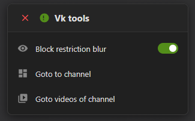

  
  <h1>VK Tools Widget 🛠️</h1>
  
A powerful Tampermonkey userscript to bypass video blur restrictions and add quick, draggable navigation tools for VK.com and VKVideo.ru.

---

## ✨ Features

- 🔓 **Bypass Restrictions:** Automatically removes annoying blur effects, age-restriction overlays, and dark filters from videos and thumbnails.
- 🚀 **Quick Navigation:** Instantly jump to a creator's channel or video tab with a single click.
- 🖱️ **Draggable UI:** Features a sleek, dark-mode widget that can be dragged and placed anywhere on the screen to prevent obstructing content.
- 💾 **Persistent Settings:** Remembers your widget position, toggle states, and visibility settings even after a page reload.
- 🧠 **Smart Extraction:** Uses intelligent Regex to extract channel IDs directly from URLs (e.g., `/@club123`) or falls back to DOM parsing.
- 🛡️ **Shadow DOM Isolated:** The widget is built using Shadow DOM, ensuring complete isolation from VK's CSS, so the UI never breaks.

## ⚙️ Installation

1. Install a userscript manager extension like [Tampermonkey](https://www.tampermonkey.net/) or [Violentmonkey](https://violentmonkey.github.io/).
2. Click the link below to install the script directly:

   👉 **[Install VK Tools Script](https://raw.githubusercontent.com/YOUR_USERNAME/YOUR_REPOSITORY_NAME/main/vk-tools.user.js)**

   *(Note: Replace `YOUR_USERNAME` and `YOUR_REPOSITORY_NAME` with your actual GitHub details).*
3. Confirm the installation in your userscript manager.

## 💻 Usage

- Once installed, open any video on `vkvideo.ru` or `vk.com`.
- The **VK Tools Widget** will appear in the top-right corner.
- **Drag & Drop:** Click and hold the header of the widget to drag it anywhere on the screen.
- **Toggle Blur:** Use the `Block restriction blur` switch to enable or disable the restriction bypass.
- **Navigate:** Use the action buttons to visit the uploader's channel seamlessly.
- **Hide/Show:** Click the red `X` to hide the widget. You can bring it back at any time via the Tampermonkey extension menu by clicking `👁️ Show / Hide Vk tools Menu`.

## 📸 Screenshots

*(Upload a screenshot of the widget to your repository and replace the link below)* 

## 📜 License
